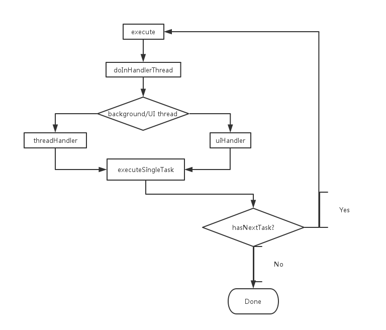

### Async(Chained)Task

既然链式调用这么流行, 那么把AsyncTask也做成链式的好了。

核心流程:



可以看到实现方式非常naive, 如果加上lambda, 就会变成这样:

```
// 这个例子是无返回参数的任务
new Tasker()
        .justDo(() -> doSomeThing()).on(Task.ThreadMode.BACKGROUND_THREAD)
        .justDo(() -> updateUI()).on(Task.ThreadMode.UI_THREAD)
        .justDo(() -> complete()).on(Task.ThreadMode.UI_THREAD)
        .execute();

// 这个例子是有返回参数的任务
new Tasker(new TaskParam(0, "-_-||", 1, ":P"))
        .next(taskParam -> step1(taskParam)).on(Task.ThreadMode.BACKGROUND_THREAD)
        .next(taskParam -> step2(taskParam)).on(Task.ThreadMode.BACKGROUND_THREAD)
        .next(taskParam -> step3(taskParam)).on(Task.ThreadMode.UI_THREAD)
        .execute();
```

当然, 还是建议不要这样写, lambda本身就匿名函数, 重写一个方法没必要, 这里只是为了美观...

